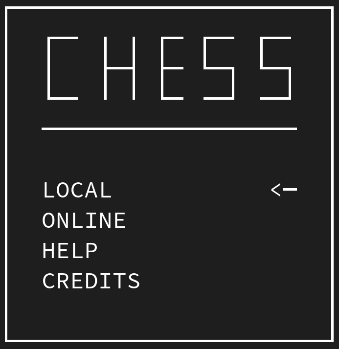
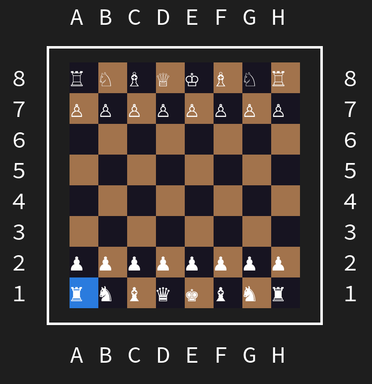

# Chess challenge
A Chess game for the Furdevs coding challenge 0x001.

## Features
- All rules implemented, except
  - Draw (same position three times in a row)
  - Castling
- Animations
  - Except for the field, no time left
- Colors
  - except for the menu, no time left
- Chess game universal
  - Can be easily ported to other GUI libraries
- Fully running in the terminal
- Cross-platform
- Fast (all 36 test suits take 2ms on a low-end laptop)
- Fully tested
  - The chess engine is fully covered by unit testing

## Screenshots



## Pre-build binaries
Check the release [here](https://github.com/MCWertGaming/Furdevs-Chess/releases/tag/submission).

## Compiling
### Linux
```bash
cmake .
make
```
## Windows
It is recommended to use Visual Studio Community or CLion for compiling.

## Dependencies
- CPP-Terminal (Terminal control across systems)
- Foxspace (small utils that were helpful)
- Google Test (Unit testing)

## Special Thanks
- The Furdevs team for making this challenge
- Everyone participating and / or watching the challenge

## License
This software is MIT licensed.
